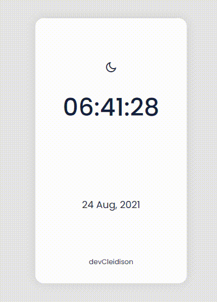

# ui-clock




> O projeto trata-se de um relógio com calendário e foi desenvolvido com as tecnologia <strong>HTML5</strong>, <strong>CSS3</strong> e <strong>Javascript</strong>.


## 💻 Pré-requisitos

Antes de começar, verifique se você atendeu aos seguintes requisitos:

* Navegador `<Google Chrome / Firefox / Microsoft Edge>`


## 🚀 Instalando o ui-clock

Para instalar o ui-clock, siga estas etapas:

Linux, macOS e Windows:
```
git clone https://github.com/devCleidison/ui-clock.git
```

ou baixe o arquivo compactado diretamente pelo link:
```
https://github.com/devCleidison/ui-clock/archive/refs/heads/main.zip
```

## ☕ Usando o ui-clock

Para usar o ui-clock, siga estas etapas:

```
Abra a pasta do projeto e execute o arquivo index.html dando 2 cliques
```

## 🚀 Quer testar antes de baixar?
* [Clique aqui!](https://devcleidison-ui-clock.netlify.app/)

## 📫 Contribuindo para ui-clock

Para contribuir com o ui-clock, siga estas etapas:

1. Bifurque este repositório.
2. Crie um branch: `git checkout -b <nome_branch>`.
3. Faça suas alterações e confirme-as: `git commit -m '<mensagem_commit>'`
4. Envie para o branch original: `git push origin <nome_do_projeto> / <local>`
5. Crie a solicitação de pull.

Como alternativa, consulte a documentação do GitHub em [como criar uma solicitação pull](https://help.github.com/en/github/collaborating-with-issues-and-pull-requests/creating-a-pull-request).


[⬆ Voltar ao topo](#ui-clock)<br>